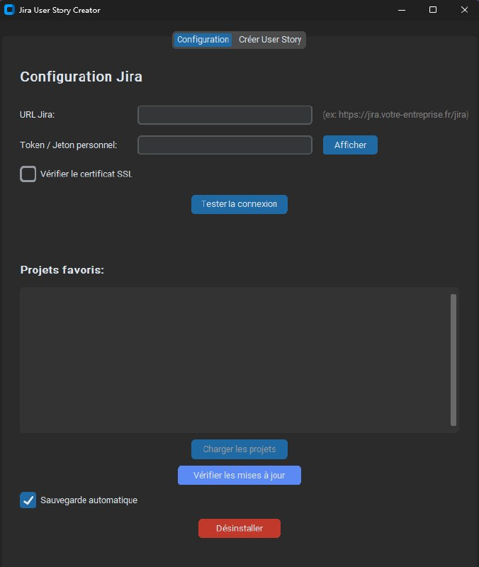
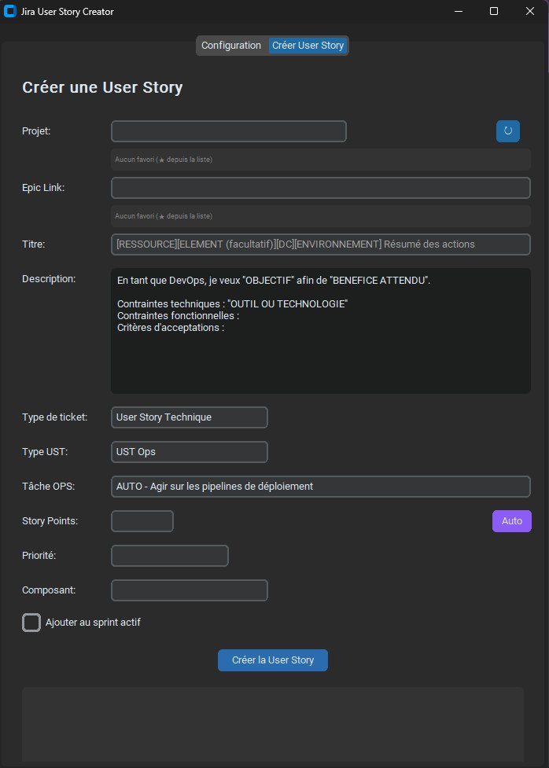

# JiraUSCreator

<p align="center">
  
  
  
  
  
</p>

<p align="center"><strong>Windows app to create Jira user stories faster, with reusable templates and a simple workflow.</strong><br/>
<strong>Application Windows pour créer des user stories Jira plus vite, avec des modèles réutilisables et un workflow simple.</strong></p>

---

## Quick facts / Faits rapides

- **Platform:** Windows desktop (executable)  
  **Plateforme :** Windows desktop (exécutable)
- **Language:** Python 3.10+ for build, executable distributed  
  **Langage :** Python 3.10+ pour la compilation, exécutable distribué
- **License:** MIT  
  **Licence :** MIT
- **Topics:** jira, windows, automation, ux, developer-tools  
  **Sujets :** jira, windows, automation, ux, developer-tools

---

## Highlights / Points forts

- Create user stories faster with templates, a story point helper, and optional sprint assignment.  
  Créez des user stories plus vite avec des templates, une aide aux story points et l’ajout optionnel au sprint.
- Find projects and epics quickly, with favorites for the ones you use most.  
  Trouvez rapidement projets et epics, avec des favoris pour les plus utilisés.
- Save and reuse templates to keep ticket creation consistent.  
  Sauvegardez et réutilisez des templates pour garder une création homogène.
- Simple desktop UI, local configuration, no unnecessary setup.  
  Interface desktop simple, configuration locale, sans complexité inutile.

### Configuration screen / Écran de configuration



### Create User Story screen / Écran de création de User Story



---

## Install & run / Installation et exécution

1. Download the latest release from Releases.  
   Téléchargez la dernière release depuis Releases.
2. Copy `JiraUSCreator.exe` to a folder and run it.  
   Copiez `JiraUSCreator.exe` dans un dossier et lancez-le.
3. In Configuration, set your Jira URL and Personal Access Token, test connection, then save.  
   Dans Configuration, renseignez l’URL Jira et votre Personal Access Token, testez la connexion puis sauvegardez.

---

## Build from source / Compiler depuis les sources

```powershell
# Clone / Cloner
git clone https://github.com/DavyLss/jira-us-creator.git
cd jira-us-creator

# Install dependencies / Installer les dépendances
pip install -r requirements.txt

# Build (Windows) / Compiler (Windows)
.\build.bat
```

Executable will be in `dist\JiraUSCreator.exe`.  
L’exécutable sera dans `dist\JiraUSCreator.exe`.

---

## Configuration

Local config path: `%LOCALAPPDATA%\jira-us-creator\config.json`  
Chemin de configuration locale : `%LOCALAPPDATA%\jira-us-creator\config.json`

Settings are stored locally, and no secrets belong in the repository.  
Les paramètres sont stockés localement, et aucun secret ne doit être dans le dépôt.

Use a Personal Access Token with only the scopes your Jira setup really needs.  
Utilisez un Personal Access Token avec uniquement les permissions nécessaires.

---

## Usage / Utilisation

- Open the app, pick a project, or use your favorites.  
  Ouvrez l’application, choisissez un projet, ou utilisez vos favoris.
- Select or search for an Epic, fill in the story, then estimate the story points.  
  Sélectionnez ou recherchez un Epic, remplissez la user story, puis estimez les story points.
- Optionally add the new issue to the active sprint.  
  Ajoutez éventuellement la nouvelle issue au sprint actif.
- Create the ticket, and it is sent to the target Jira instance.  
  Créez le ticket, et il est envoyé vers votre instance Jira cible.

---

## Security & privacy / Sécurité & vie privée

- Do not commit your Jira token, it is stored locally in user config only.  
  Ne commitez pas votre token Jira, il reste uniquement en local.
- Prefer scoped tokens with the least privileges required for creation and sprint updates.  
  Préférez des tokens restreints aux permissions minimales nécessaires pour la création et la mise à jour de sprint.

---

## License / Licence

MIT License, see the LICENSE file.  
Licence MIT, voir le fichier LICENSE.
